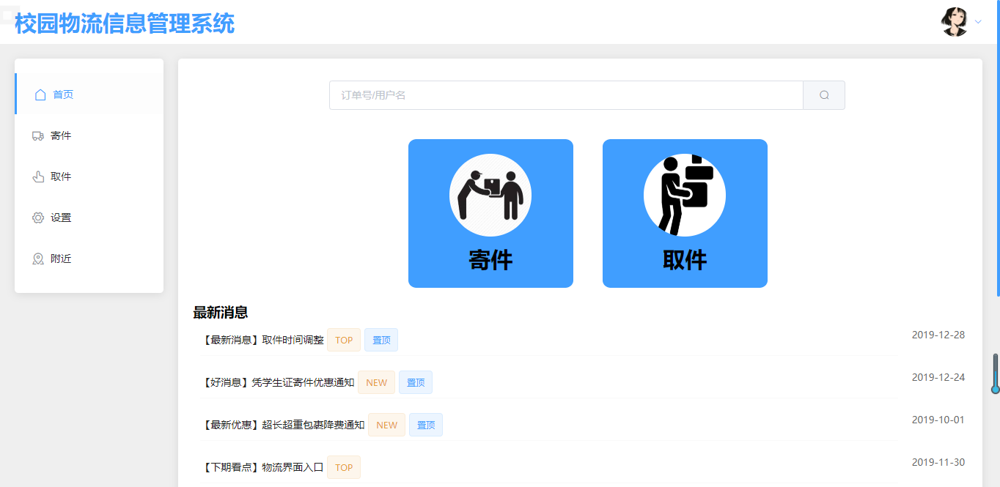
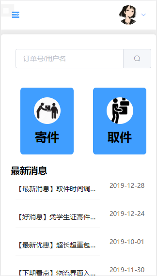
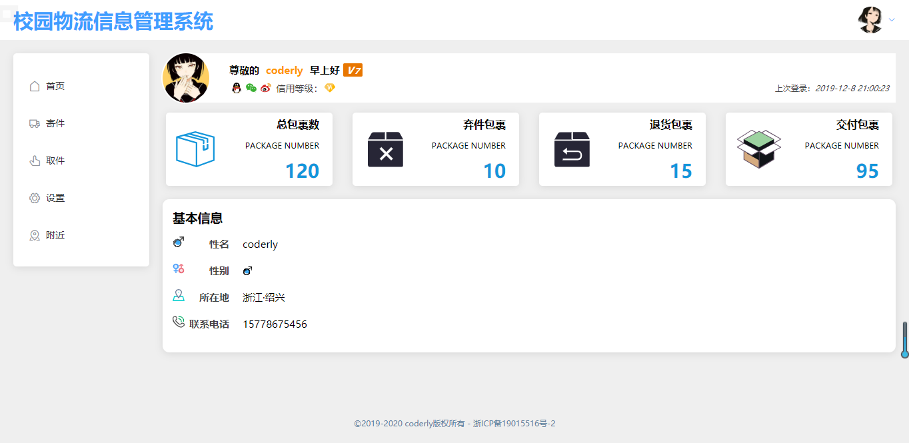
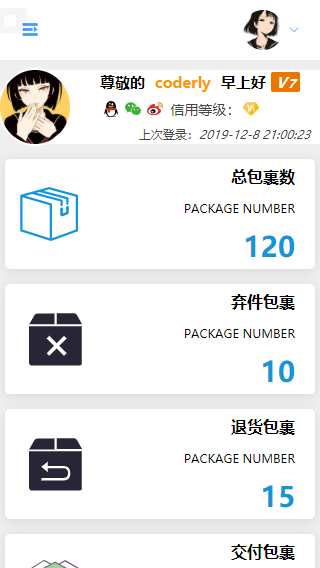
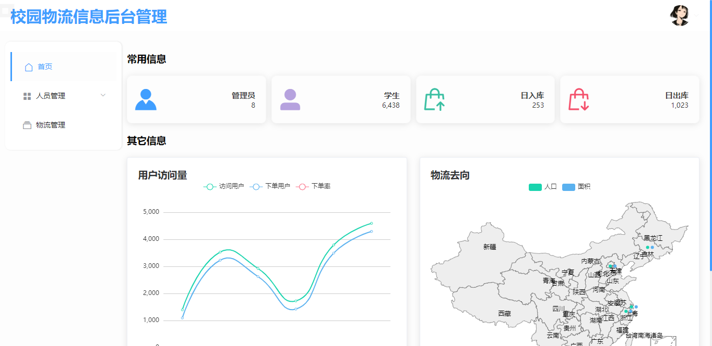
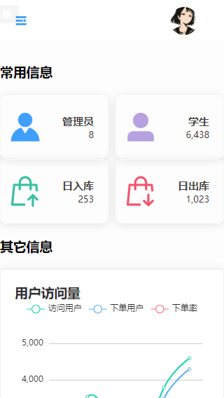
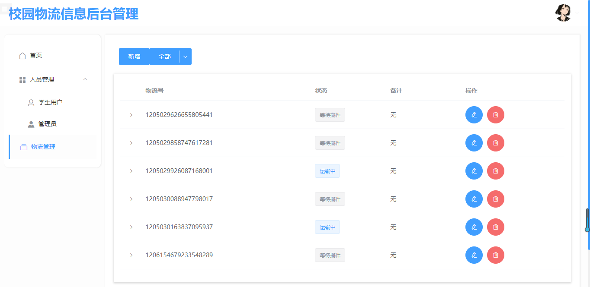
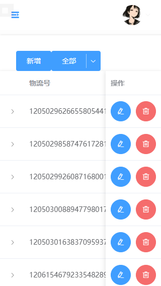

# 校园物流管理信息系统
- 管理员界面
admin
123456
- 普通用户界面
user
123456
## 效果

### 前台






### 后台






## 说明

1. 本项目使用vue.js + element-ui
2. 项目中包含前台和后台页面
3. 前后端分离
4. 通过用户type类型判断是否管理员，并重置路由
5. 使用localstorage存储用户id模拟token，后以id拉取用户信息

## 使用
```
npm install
npm run serve
npm run build
```

